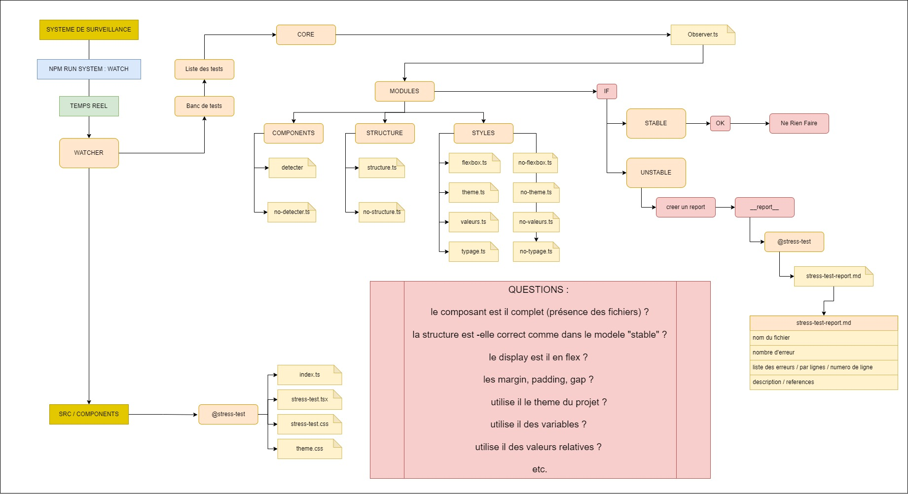

# 🎯 Système de Contrôle des Composants

<div align="center">
  
  <p><em>Architecture logique du système de contrôle</em></p>
</div>

## 📋 Vue d'ensemble

Ce système de contrôle des composants est conçu pour assurer la qualité et la conformité des composants React dans notre application. Il surveille en temps réel les modifications et vérifie automatiquement le respect des bonnes pratiques.

## 🖥️ Interface Utilisateur

<div align="center">
  
  <p><em>Interface de surveillance des composants</em></p>
</div>

## 🔍 Fonctionnalités Principales

- **Surveillance en Temps Réel** : Détection automatique des nouveaux composants et des modifications
- **Validation Automatique** : Vérification de la conformité avec les standards définis
- **Rapports Détaillés** : Génération de rapports d'analyse pour chaque composant
- **Guide Intégré** : Documentation complète des bonnes pratiques

## 📊 Aperçu du Système

<div align="center">
  
  <p><em>Vue d'ensemble du système de contrôle</em></p>
</div>

## 🚀 Installation

```bash
# Cloner le dépôt
git clone https://github.com/French-Team/System-control-components.git

# Installer les dépendances
npm install

# Lancer le système de surveillance
npm run watch
```

## 📘 Documentation

Pour plus de détails sur l'utilisation du système, consultez :
- [Guide des Bonnes Pratiques](src/__test-system__/guide.md)
- [Procédure de Développement](Procédure.md)
- [Notes d'Amélioration](src/__test-system__/amelioration-notes.md)

## 🛠️ Structure du Projet

```
src/
├── __test-system__/    # Système de surveillance
│   ├── core/          # Noyau du système
│   ├── modules/       # Modules d'analyse
│   └── references/    # Composants de référence
├── components/        # Composants de l'application
└── public/           # Ressources publiques
    ├── interface.jpg  # Interface utilisateur
    ├── logique.jpg   # Architecture logique
    └── apercu.jpg    # Aperçu du système
```

## 🤝 Contribution

Les contributions sont les bienvenues ! Consultez notre guide de contribution pour plus d'informations.

## 📝 Licence

Ce projet est sous licence MIT. Voir le fichier [LICENSE](LICENSE) pour plus de détails.

---
<div align="center">
  <p>Développé avec ❤️ par French-Team</p>
</div>
