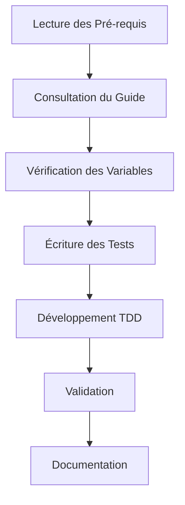

# ⚠️ PRÉ-REQUIS ET AVERTISSEMENTS ⚠️

## IMPORTANT - À LIRE AVANT TOUTE MODIFICATION

Vous vous apprêtez à travailler sur un projet qui implémente des règles strictes et des standards élevés de développement. Ce n'est pas un projet classique où vous pouvez simplement commencer à coder.

### 🚨 Avertissements

1. **Complexité du Projet**

   - Ce projet utilise une architecture complexe et structurée
   - Chaque composant suit des règles précises de développement
   - Les standards de qualité sont non négociables

2. **Documentation Obligatoire**

   - Un guide complet de développement existe et DOIT être suivi
   - Chaque étape du développement est documentée
   - Des points de contrôle obligatoires sont définis

3. **Méthodologie Stricte**

   - Le développement suit la méthode TDD (Test-Driven Development)
   - Les variables et le design system sont centralisés
   - Les conventions de nommage sont standardisées

4. **Environnement de Test Spécifique**
   - Utilisation OBLIGATOIRE de Vitest (PAS Jest)
   - Configuration spécifique pour React Testing Library
   - Tests unitaires, d'intégration et end-to-end

## 📚 Guide de Développement

### 1. Avant de Commencer

- [ ] Lire le guide complet des bonnes pratiques
- [ ] Comprendre la structure du projet
- [ ] Identifier les standards à respecter

### 2. Points de Contrôle Initiaux

- [ ] Vérifier que vous avez accès à toute la documentation
- [ ] Comprendre la hiérarchie des composants
- [ ] Identifier les dépendances du projet

### 3. Règles Fondamentales

1. **Aucun Développement Sans Tests**

   ```typescript
   // ❌ INCORRECT
   function MonComposant() {
     // Commencer directement le développement
   }

   // ✅ CORRECT
   // 1. Écrire les tests
   // 2. Définir les variables
   // 3. Implémenter le composant
   ```

2. **Variables Centralisées Obligatoires**

   ```css
   /* ❌ INCORRECT */
   .composant {
     color: #000;
     margin: 20px;
   }

   /* ✅ CORRECT */
   .composant {
     color: var(--component-color-primary);
     margin: var(--component-spacing-md);
   }
   ```

3. **Documentation Systématique**

   ```typescript
   // ❌ INCORRECT
   export const MonComposant = () => {...}

   // ✅ CORRECT
   /**
    * @description Composant qui suit les standards du projet
    * @requires Variables définies dans _variables.css
    * @requires Tests dans MonComposant.test.tsx
    */
   export const MonComposant = () => {...}
   ```

## 🛠️ Processus de Développement

1. **Phase Préparatoire**

   - Consulter [`01-glossaire.md`](./01-glossaire.md)
   - Étudier [`02-variables-centralisees.md`](./02-variables-centralisees.md)
   - Comprendre le système de design

2. **Phase de Développement**

   - Suivre strictement la méthode TDD
   - Utiliser les variables centralisées
   - Respecter les conventions de nommage

3. **Phase de Validation**
   - Exécuter tous les tests
   - Vérifier les points de contrôle
   - Valider la documentation

## ⚡ Workflow Quotidien



## 🎯 Objectifs de Qualité

- Tests couvrant 100% du code
- Documentation complète et à jour
- Respect strict des conventions
- Performance optimale
- Accessibilité maximale

## 🚫 Ce Qui N'Est Pas Accepté

1. **Code Non Testé**

   - Tout code doit avoir des tests associés
   - Les tests doivent être écrits AVANT le code

2. **Variables Hardcodées**

   - Toutes les valeurs doivent utiliser des variables
   - Les variables doivent être centralisées

3. **Documentation Manquante**
   - Chaque composant doit être documenté
   - Les modifications doivent être tracées

## 📋 Liste de Vérification Finale

Avant de commencer tout développement :

- [ ] J'ai lu et compris ce document
- [ ] J'ai accès à tous les guides nécessaires
- [ ] Je comprends la méthode TDD
- [ ] Je sais où trouver les variables centralisées
- [ ] Je connais les points de contrôle à valider

## ⚠️ Rappel Important

Si vous n'êtes pas sûr d'une règle ou d'une pratique :

1. Consultez la documentation
2. Demandez à l'équipe
3. NE FAITES PAS de suppositions

**Ne commencez jamais le développement sans avoir compris et accepté ces règles.**

## 📚 Structure de la Documentation

### Hiérarchie des Documents

1. **Documents Fondamentaux** (Aucune Dépendance)

   - `00-pre-requis.md` (Ce document)
   - `01-glossaire.md`

2. **Documents de Design System** (Dépendent des Fondamentaux)

   - `02-variables-centralisees.md` → Requis pour tous les autres documents
   - `03-systeme-couleurs.md` → Dépend de 02
   - `04-typographie.md` → Dépend de 02

3. **Documents de Test et Structure** (Dépendent du Design System)

   - `05-tests-configuration.md` → Dépend de 00-02
   - `06-structure-fichiers.md` → Dépend de 02
   - `07-structure-exports.md` → Dépend de 06

4. **Documents de Composants** (Dépendent de Tout ce qui Précède)
   - `08-disposition.md` → Dépend de 02-07
   - `09-gestion-overlays.md` → Dépend de 02-07
   - `10-images-et-icones.md` → Dépend de 02-07
   - `11-grilles-et-calculs.md` → Dépend de 02-07

### Points de Validation

- ✅ Chaque document dépend uniquement des documents qui le précèdent
- ✅ Les documents de même niveau peuvent être lus dans n'importe quel ordre
- ✅ Les documents fondamentaux n'ont aucune dépendance
- ✅ Les documents de composants intègrent tous les concepts précédents

### Liste des Fichiers de Référence

0. **Fondamentaux**

   - [`00-pre-requis.md`](./00-pre-requis.md) - Ce document
   - [`01-glossaire.md`](./01-glossaire.md) - Terminologie et concepts

1. **Design System**

   - [`02-variables-centralisees.md`](./02-variables-centralisees.md) - **OBLIGATOIRE**
   - [`03-systeme-couleurs.md`](./03-systeme-couleurs.md)
   - [`04-typographie.md`](./04-typographie.md)

2. **Tests et Structure**

   - [`05-tests-configuration.md`](./05-tests-configuration.md) - **OBLIGATOIRE**
   - [`06-structure-fichiers.md`](./06-structure-fichiers.md)
   - [`07-structure-exports.md`](./07-structure-exports.md)

3. **Composants**
   - [`08-disposition.md`](./08-disposition.md)
   - [`09-gestion-overlays.md`](./09-gestion-overlays.md)
   - [`10-images-et-icones.md`](./10-images-et-icones.md)
   - [`11-grilles-et-calculs.md`](./11-grilles-et-calculs.md)

## 🛠️ Environnement de Test

### Configuration Vitest

```typescript
// vite.config.ts
import { defineConfig } from 'vite';
import react from '@vitejs/plugin-react';

export default defineConfig({
  plugins: [react()],
  test: {
    globals: true,
    environment: 'jsdom',
    setupFiles: './src/test/setup.ts',
    include: ['**/*.{test,spec}.{ts,tsx}'],
    coverage: {
      reporter: ['text', 'json', 'html'],
      exclude: ['node_modules/', 'src/test/setup.ts'],
    },
  },
});

// src/test/setup.ts
import '@testing-library/jest-dom';
import { expect, afterEach } from 'vitest';
import { cleanup } from '@testing-library/react';
import matchers from '@testing-library/jest-dom/matchers';

expect.extend(matchers);
afterEach(() => {
  cleanup();
});
```

### Exemple de Test avec Vitest

```typescript
// MonComposant.test.tsx
import { describe, it, expect } from 'vitest';
import { render, screen } from '@testing-library/react';
import MonComposant from './MonComposant';

describe('MonComposant', () => {
  it('devrait utiliser les variables CSS centralisées', () => {
    render(<MonComposant />);
    const element = screen.getByTestId('mon-composant');
    const styles = window.getComputedStyle(element);
    expect(styles.getPropertyValue('--component-color-primary')).not.toBe('');
  });
});
```
